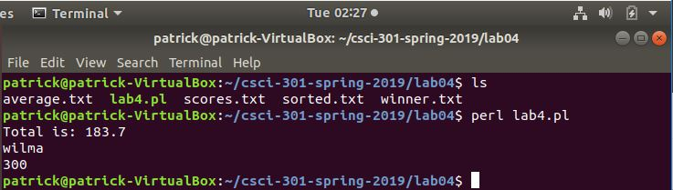
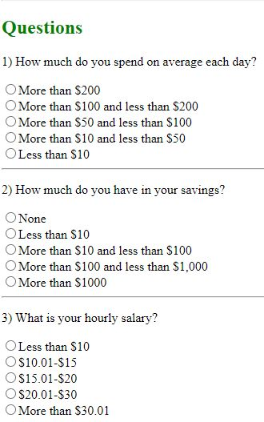

Portfolio
=========

Programming Projects
--------------------

*For access to my private project repositories, please [email me](mailto:pesnow@csustudent.net?subject=GitHub%20Access) with the subject line, GitHub Access.

---
### [Shell Script, Perl, and Python | CSCI 301](project1)

---
### [Hangman Trivia | CSCI 325](project2)

---
### [Cents and Sense | CSCI 434](project3)

---
### [Assembly Code and Verilog | CSCI 330](project4)

---

Ethics Papers
-------------

### [Copyright](/pdf/Copyright.pdf)

-   **Class:** CSCI 301 Survey of Scripting Languages  
-   **Grade:** A

### [Intellectual Property Rights?](/pdf/NetworkingPaperFinal.pdf)

-   **Class:** CSCI 332 Applied Networking 
-   **Grade:** A

### [Autonomous Inventions](/pdf/DataStructureEthicsPaper.pdf)

-   **Class:** CSCI 315 Data Structure 
-   **Grade:** B - Unverified

---

Presentations
-------------

### [Hangman Trivia](/pdf/hangman_trivia.pdf)

- **Class:** CSCI 325 Object-Oriented Programming 
- **Grade:** A

### [Hack on St. Jude](/pdf/Hack_on_St_Jude.pdf)

- **Class:** CSCI 301 Survey of Scripting Languages 
- **Grade:** A

---

Page template forked from <a href="https://github.com/csu-cs/csci-portfolio">CSU-CS</a>

<!-- Remove above link if you don't want to attributive -->
