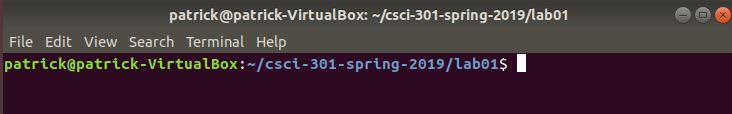
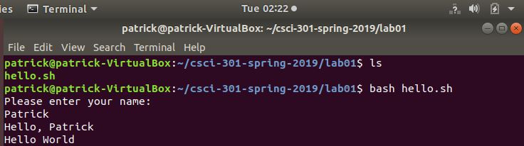
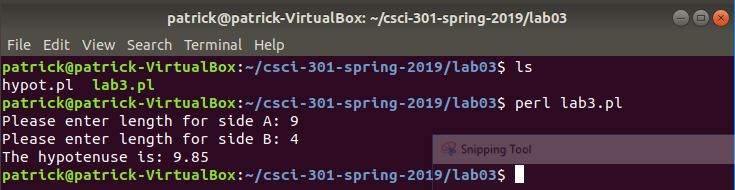
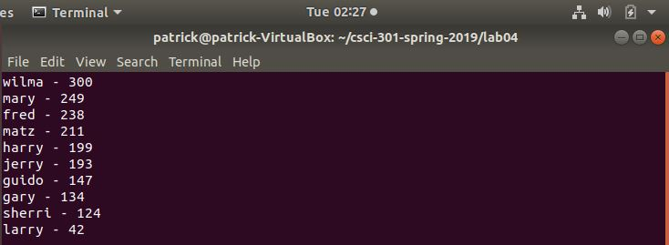
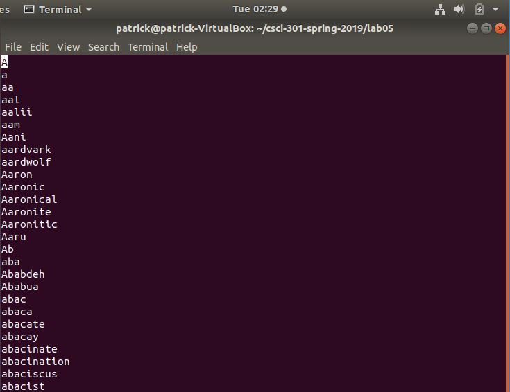

[Back to Portfolio](./)

Shell Script, Perl, and Python
===============

-   **Class:** CSCI 301 - SURVEY OF SCRIPTING LANGUAGES
-   **Grade:** A
-   **Language(s):** Shell Script, Perl, and Python
-   **Source Code Repository:** [soccerguy820/csci-301](https://github.com/soccerguy820/csci-301)  
    (Please [email me](mailto:pesnow@csustudent.net?subject=GitHub%20Access) to request access.)

## Project description

This repository will consist of a couple assignments that utilized the languages known as Shell Script, Perl, or Python. Each lab utilizes different languages to execute certain commands ranging from sorting out a file to finding the largest value from another file.

## How to compile and run the program

How to compile and run the project.

For Python:
```bash
cd ./project
python test.py
```

For Shell Script:
```bash
cd ./project
sh hello.sh
```

For Perl:
```bash
cd ./project
perl lab3.pl
```

## UI Design

Under the lab01 folder, "hello.sh" will request the user to enter a name then it will send the user a message saying, "Hello, (User's name)". After it says hello to the user then it will prompt a message saying, "Hello World" as shown in Figure 1. Lab03 utilizes the language of Perl. Lab03 starts with a file named, "lab3.pl" which prompts the user to enter a number value for two sides of a triangle. Then it will send the user a message indicating how long the hypotenuse needs to be to make the triangle a right triangle (Shown in Figure 2). Lab04 utilizes the language of Perl. Lab04 starts with a file named, "lab4.pl" which first establishes the values of the bowlers in the list. Second, it establishes the value of sum by adding up all of the numbered values that is assigned to each of the bowlers in the list. Next, it follows a couple steps of opening certain files, printing their associated values for each file, then closing the file after it finishes printing their designated command as shown in Figure 4 and 5. Lab05 utilizes the language of Python. Under the Lab05 folder, "helloname.py" will prompt the user to enter their name then send the user a message saying, "Hello, (User's name)". Also, under the Lab05 folder there is a file named, "vowels.py" which will Use a regex to find all words in the words.txt file that contain 1-3 consecutive vowels and save these words to a file named vowels.txt. Lab06 also utilizes the Python language. The file under Lab06 is named, "RightTriangle.py" which establishes a class named, "RightTriangle" which takes inputs for two sides of a triangle. Then it will determine how long the hypotenuse would need to be make it a right triangle (Shown in Figure 6). Under testOne folder, there is a file named, "test.py" which opens a file named, "testone.txt". Next, it establishes a list of values by obtaining each indvidual numbers. Then it prints the largest number from the "testone.txt" file and writes the same number into another file named, "patrickSnowAnswer.txt".

  
Fig 1. The terminal screen on Ubuntu

  
Fig 2. Lab01 Shell Script code execution.

  
Fig 3. Lab03 Perl code execution.

  
Fig 4. Lab04 Perl code execution.

  
Fig 5. Lab04 Ordered list file text.

  
Fig 6. Lab05 Python code execution.


For more details see [GitHub Flavored Markdown](https://guides.github.com/features/mastering-markdown/).

[Back to Portfolio](./)
