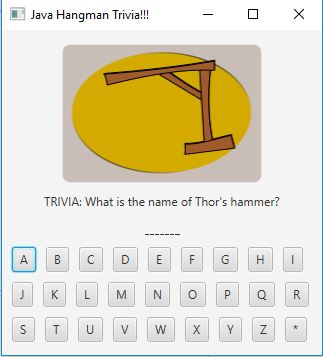
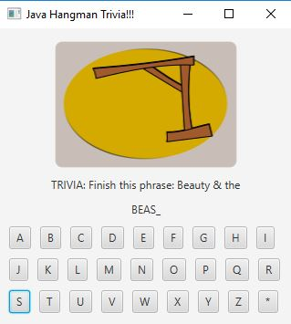
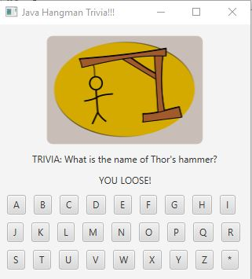
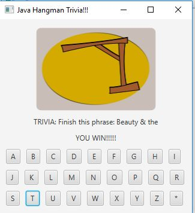

[Back to Portfolio](./)

Hangman
===============

-   **Class:** CSCI 325 - OBJECT-ORIENTED PROGRAMMING
-   **Grade:** A
-   **Language(s):** Java
-   **Source Code Repository:** [soccerguy820/Hangman](https://github.com/soccerguy820/Hangman)  
    (Please [email me](mailto:pesnow@csustudent.net?subject=GitHub%20Access) to request access.)

## Project description

The Hangman project main language is java script. It was designed to play as a game called, "Hangman." The game prompts to guess what the answer is before he/she uses up
all of their chances.

## How to run the program

How to compile and run the project.

Make sure to save the Java source file, right-click the project and choose Run or choose Run Project under the Run menu. Click Select Main Class. If more support is needed to run then click on this [link](https://netbeans.apache.org/kb/docs/java/quickstart.html#:~:text=A%20Reference%20Guide.-,Running%20the%20Application,Congratulations!)

## UI Design

First, to run the program the user would need to click on the Run and Debug button in Netbeans or simply hit F5. This will take a few minutes for the application to debug and make sure there is no error before running the java project. Once, it finishes debugging it will
run the project (HMGUI and HMCHECKER). The starting screen will be shown as displayed on Figure 1. Every time the user guesses incorrectly it will update the picture to the next stage
or next body part to the hangman as shown in Figure 2. The progression or increase of body parts indicate how close or if they already lost the game as shown in Figure 3.
If the user guesses all of the words in the correct order than they will be prompted with a congratulation's message as shown in Figure 4. This project was done by three people as a group.
The codes done by each people are detailed in the files and are also detailed in the Powerpoint that is also in the portfolio. To find the Powerpoint, it is found at the bottom with presentations named, "Hangman Trivia." It will give a detail to what each method will do once
the project is debugged and run.

  
Fig 1. The launch screen

  
Fig 2. Example output after input is processed.

  
Fig 3. Feedback when the player loses.

  
Fig 4. Feedback when a player wins the game.

For more details see [GitHub Flavored Markdown](https://guides.github.com/features/mastering-markdown/).

[Back to Portfolio](./)
