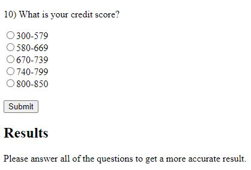

[Back to Portfolio](./)

Cents and Sense Website
===============

-   **Class:** CSCI 434 - Human-Computer Interaction
-   **Grade:** C
-   **Language(s):** HTML, Javascript, CSS
-   **Source Code Repository:** [soccerguy820/CentsandSense2](https://github.com/soccerguy820/CentsandSense2)  
    (Please [email me](mailto:pesnow@csustudent.net?subject=GitHub%20Access) to request access.)

## Project description

Cents and Sense is an application that will grade on the user’s answers to several questions in regards to their handling of their money. It will be able to assist any users especially college students during their most stressful and tedious days by suggesting the user on whether they have been handling their money poorly or not. It was made to be a quick, simple, and efficient application so the user can easily determine how they have been handling their money. 

## How to compile and run the program

How to run the project.

Depending on where you saved the files that are saved in the repository. It should be able to run with its file source. An example would be file:///C:/Users/snowg/Documents/CentsandSense2/index.html?

## UI Design

Cents and Sense is an application that is to assist any users in determining how they handle their money well or not. 
First, it will require the user to enter a username and password if they are new to the website. After he/she has finished registering their new acccount
then they can login with same username and password (Figure 1 and 2). After a successful login they will be taken to the home page.
It will ask ten questions each with five answers in the form of radio buttons. All of the answers have a different value assigned to them that determines 
if they handled their money well or not for each questions (Figure 3). The values to determine the user’s answers are very bad, bad, neutral, good, and very good.
If the user tries to click the submit button before answering all of the questions then it will notify the user to answer all of the questions so he/she can get the result (Figure 4).
After the user answers all of the questions then they will get their score (Figure 5).

  
Fig 1. The home page or login page of the website.

  
Fig 2. The error message when a login was unsuccessful.

  
Fig 3. The survey page with questions for the user.

  
Fig 4. A notification for the user to answer all questions.

  
Fig 5. The results given after all answers are given by the user.

For more details see [GitHub Flavored Markdown](https://guides.github.com/features/mastering-markdown/).

[Back to Portfolio](./)
