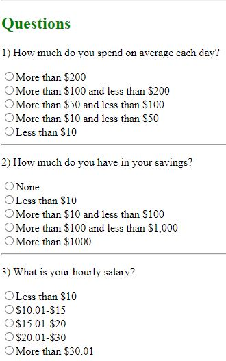

[Back to Portfolio](./)

Cents and Sense Website
===============

-   **Class:** CSCI 330 - Computer Architecture
-   **Grade:** A
-   **Language(s):** Assembly Code (.asm) and Verilog (.v)
-   **Source Code Repository:** [soccerguy820/csci-330](https://github.com/soccerguy820/csci-330)  
    (Please [email me](mailto:pesnow@csustudent.net?subject=GitHub%20Access) to request access.)

## Project description

This repository will consist of a couple assignments that utilized the languages known as Assembly machine code and Verilog. Each lab utilizes different languages to execute certain commands ranging from sorting out an assembly code executing certain commands to making gates with Verilog.

## How to compile and run the program

How to compile and run the project.

For Assembly:
```bash
cd ./[file name here]
nasm -felf64 [assembly code here] && gcc -no-pie -fPIC hello-printf.o && ./a.out
```

For Verilog:
```bash
cd ./[file name here]
iverilog *.v && ./a.out
```


## UI Design

Lab01.asm writes "Hello from C library" and then prints an the integer 2022 to the console using a C library.
Lab02.asm takes the sum of all the elements of array1 and array2 and prints the total sum.
Lab03.asm finds the sum of all the elements of the array using a loop and prints the sum.
Lab04.asm is assembly for the following:
 int multadd(int y) {
   int a;
   a = 23;
   return y * y + a;
 }
 int main() {
     printf("%ld\n", example(33);
 }
 
 Verilog lab01.v is writing the NAND gate and the verilog inputs.
 Verilog lab02.v is writing with multiple gates to form one model.
 Verilog lab03.v is similar to lab02.v but trying to form a bigger model.
 Verilog lab04 is writing NAND gates to form an SR Latch.
 Verilog lab05 is writing more NAND gates in combination with a SR Latch to form a Gated SR Latch.

  
Fig 1. The home page or login page of the website.

  
Fig 2. The error message when a login was unsuccessful.

  
Fig 3. The survey page with questions for the user.

  
Fig 4. A notification for the user to answer all questions.

  
Fig 5. The results given after all answers are given by the user.


For more details see [GitHub Flavored Markdown](https://guides.github.com/features/mastering-markdown/).

[Back to Portfolio](./)
